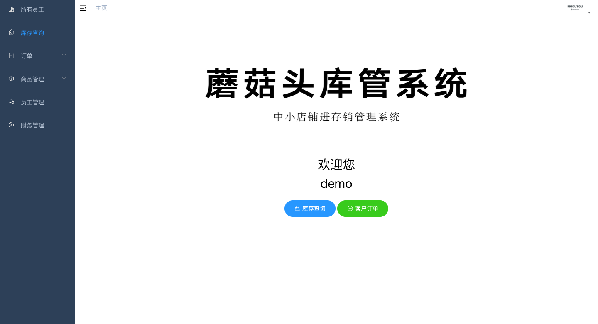
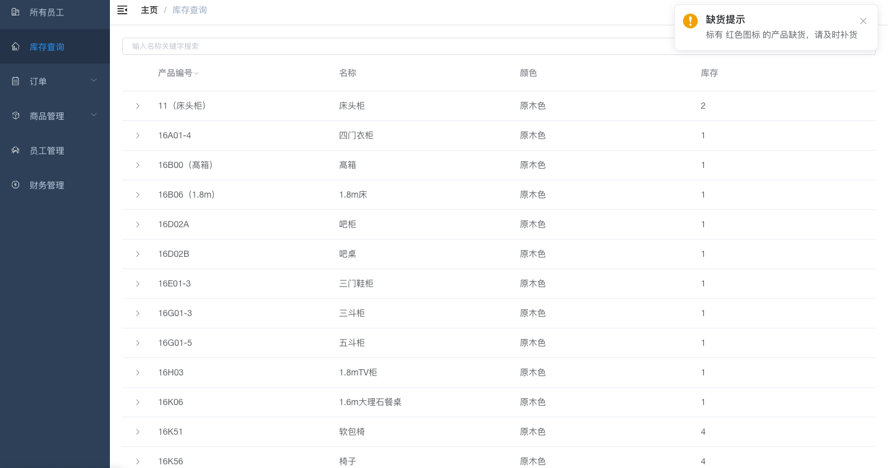
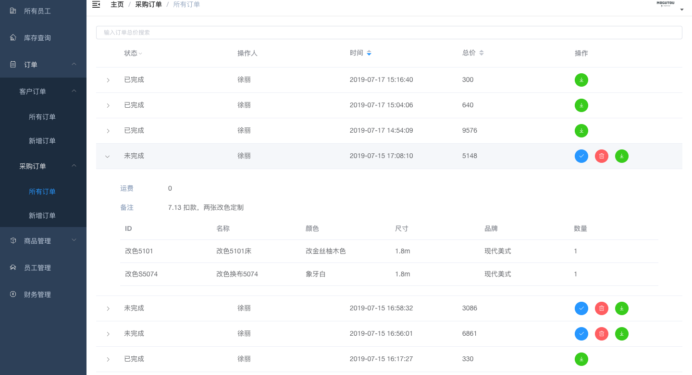
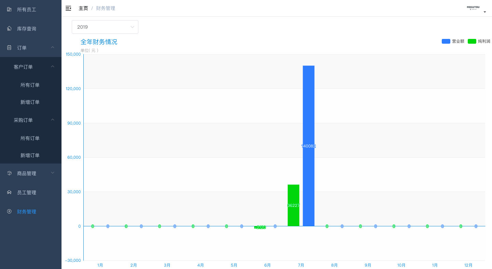
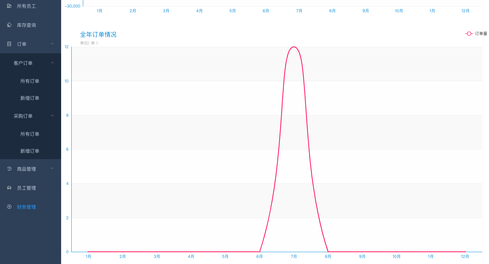

# mogutouERP 蘑菇头进存销管理系统

[](https://app.codacy.com/app/Allenxuxu/mogutouERP?utm_source=github.com&utm_medium=referral&utm_content=Allenxuxu/mogutouERP&utm_campaign=Badge_Grade_Dashboard)

mogutouERP 是一个前后端分离的微型进存销系统，采用 Gin + Vue 开发。

- 后端仓库(本仓库) https://github.com/Allenxuxu/mogutouERP
- 前端仓库 https://github.com/Allenxuxu/mogutouERP-vue

演示地址 http://demo.mogutou.xyz

账号： 11223344556

密码： mogutou

## 主要功能及效果图

- 员工账号管理
- 采购订单管理
- 销售订单管理
- 商品信息、库存管理
- 财务信息报表

> 财务信息，添加员工，商品进价管理等操作只有管理员账号可以查看并操作







## 本地运行使用

### 后端

准备一个 mysql本地 Docker 启一个 mysql，或者其它方式启动。

在 mysql 中创建一个 database

下载本仓库源码（后端）

```bash
git clone https://github.com/Allenxuxu/mogutouERP.git
```

进入源码目录查看并修改 conf 目录下的配置文件（mysql 连接信息）

```bash
cd mogutouERP/conf
vi conf.json
```

最后 cd 回顶层目录启动程序

```bash
cd ..
make run
```

### 前端

下载前端仓库源码

```bash
git clone https://github.com/Allenxuxu/mogutouERP-vue
cd mogutouERP-vue
```

```bash
npm install
# develop
npm run dev
```
然后查看浏览器 http://localhost:9528

### 登陆

默认管理员登陆账号和密码都是 **11223344556** , 登陆后修改。

## 前后端分离部署

### 后端部署

#### 数据库

后端数据存储使用 mysql 数据库，需要提前在 mysql 中建库，数据库名称随意定义，只需与配置文件中一致即可。无需提前建表，项目中采用 Gorm 自动生成。

#### 配置文件

在服务器上创建一个目录存放配置文件, 并创建两个配置文件（仓库源码 conf 目录中为 模版）

```bash
cd /opt/mogutouERP-demo

mkdir conf && touch conf.json  jwt.json
```
配置文件内容模版如下

conf.json
```
{
    "mysql": {
        "name": "root",
        "password": "123",
        "DBname": "mgt",
        "addr": "127.0.0.1:3306"
    },
    "listen": "127.0.0.1:8088"
}
```

jwt.json
```
{
    "jwt-key": "asdfasf"
}
```

#### Docker 运行

```bash
docker pull xuxu123/mogutou:v0.1.0
```

这里网络模式 --net=host , 主要是考虑大多数人都是在本机安装的 mysql，服务在容器中无法通过 127.0.0.1 直接访问 mysql 。并不建议采用 host 网络模式，但是作为演示这是最方便的。

```bash
docker run --name mogutou -v /opt/mogutouERP-demo/conf:/etc/conf  --net=host -d   xuxu123/mogutou:v0.1.0
```

查看输出日志，确认服务正常启动

```bash
docker logs mogutou
```

### 前端部署

修改 config 目录下 prod.env.js 中的 BASE_API ，改成你的域名或者服务器公网 IP 加端口即可

```
'use strict'
module.exports = {
  NODE_ENV: '"production"',
  BASE_API: '"https://xxx.xxxxx.com/api/v1"'
}
```

进入仓库顶层目录 build 生成静态文件

```bash
npm run build
```

生成 dist 目录，将 dist 目录拷贝到服务器中，使用 nginx反向代理就可以了

### Nginx 参考配置

```
server {
    listen 80;
    server_name demo.mogutou.xyz;

    root /opt/mogutouERP-demo/dist;
    index index.html;

    location / {
       try_files $uri $uri/ /index.html;
    }

    location /api {
       proxy_pass http://127.0.0.1:8088;
    }
}
```
